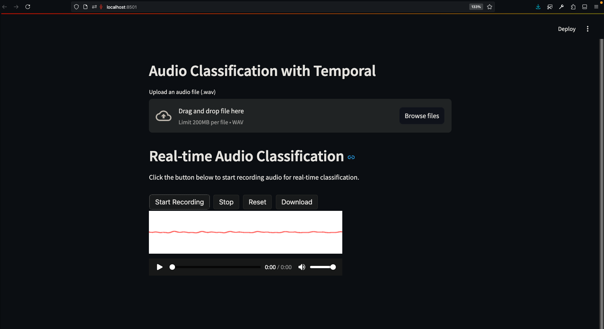
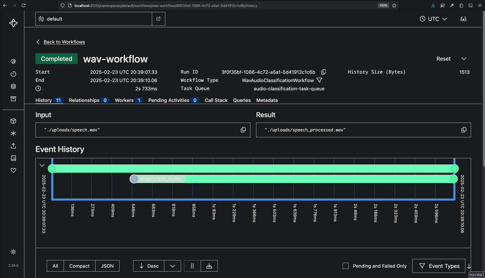

# Ensemble Model for Detecting Infant Cries, Screams, and Normal Utterances

<div style="display: flex; justify-content: space-around;">
    
    
</div>


## Abstract
This project implements a robust audio classification system capable of distinguishing between infant cries, screams, and normal utterances. The system leverages trained YAMNet and Wav2Vec2 architectures, using an ensemble approach to enhance performance. The project details dataset selection, data augmentation techniques, preprocessing steps, model architecture, training, evaluation, ensemble strategies, and deployment using Temporal and Streamlit.

## Table of Contents
1. [Data Acquisition and Preprocessing](#data-acquisition-and-preprocessing)
2. [Model Selection](#model-selection)
3. [Ensemble Model](#ensemble-model)
4. [Deployment](#deployment)
5. [Execution Steps](#execution-steps)
6. [References](#references)

---

## Data Acquisition and Preprocessing

### A. Datasets
The following datasets were used for training:
- **Infant's Cry Sound** ([Mendeley Data](https://doi.org/10.17632/hbppd883sd.1)) - 1000 audio files of infant cries, screams, and normal utterances.
- **Human Screaming Detection Dataset** ([Kaggle](https://www.kaggle.com/datasets/whats2000/human-screaming-detection-dataset)) - 1000 audio files of human screams.
- **Child Speech, Kid Speaking** ([AudioSet](https://research.google.com/audioset/dataset/child_speech_kid_speaking.html)) - 1000 audio files of child speech.

### B. Data Cleaning
- Downloaded datasets using `audioset-downloader`.
- Manually curated the dataset, removing broken links and missing files.
- Standardized all audio clips to **5 seconds** for uniformity.

#### Directory Structure
```
data/
├── cry/       # 132 .wav files (5 sec each)
├── speech/    # 132 .wav files (5 sec each)
├── scream/    # 132 .wav files (5 sec each)
```
Dataset was split into **80:20:10** for training, validation, and testing.

### C. Data Augmentation
Augmentation techniques applied:
- **Normalization**: Amplitude normalization
- **Time Stretching**: Random rate between 0.8x and 1.2x
- **Time Shifting**: Random shift up to 0.5 sec
- **Pitch Shifting**: ±2 semitones
- **Background Noise Addition**: 5-10% of signal amplitude
- **Dynamic Range Compression (DRC)**

### D. Preprocessing
- Converted all audio files to **16kHz mono-channel**.
- Converted to TensorFlow/PyTorch tensors for respective models.

---

## Model Selection

### A. YAMNet-based Classifier
- Used **1024-dimensional embeddings** from YAMNet’s feature extractor.
- Built a custom **MLP classifier** with the following architecture:
  | Layer | Output Shape | Params |
  |--------|-------------|--------|
  | Dense (ReLU) | (None, 256) | 262400 |
  | Dropout (0.3) | (None, 256) | 0 |
  | Dense (ReLU) | (None, 128) | 32896 |
  | Dropout (0.3) | (None, 128) | 0 |
  | Dense (Softmax) | (None, 3) | 387 |
- **Training**:
  - Optimizer: Adam, LR: 0.001, Loss: Categorical Cross-Entropy
  - Batch size: 32, Epochs: 30, Class weights applied

### B. Wav2Vec2-based Classifier
- Used **768-dimensional embeddings** from Wav2Vec2.
- Custom **MLP classifier**:
  | Layer | Output Shape | Params |
  |--------|-------------|--------|
  | Dense (ReLU) | (None, 256) | 262400 |
  | Dense (Softmax) | (None, 3) | 771 |
- **Training**:
  - Fine-tuning gave poor results, so used as a feature extractor.
  - Adam optimizer, categorical cross-entropy loss.

---

## Ensemble Model

### A. Ensemble Techniques
1. **Average Ensemble**: Smoothens predictions, reducing variance.
2. **Weighted Average Ensemble**: Assigns higher weights to better models.
3. **Hard Voting**: Majority voting for classification.

### B. Performance Comparison
| Model | Accuracy |
|------------------|---------|
| YAMNet | 94% |
| Wav2Vec2 | 72.5% |
| Ensemble (Avg) | **97%** |
| Ensemble (Hard Voting) | 78% |
| Ensemble (Weighted) | **97%** |

---

## Deployment

### A. Technologies Used
- **Temporal**: Handles workflow orchestration.
- **Streamlit**: Interactive UI for classification.

### B. Workflow
1. **Upload Audio**: Users can upload an audio file.
2. **Record Audio**: Users can record a live audio sample.
3. **Preprocessing**: Convert to 16kHz mono.
4. **Model Inference**: Features extracted and passed to classifiers.
5. **Classification Results**: Displayed with confidence scores.
6. **Save Results**: Outputs saved in `.json` for reference.

---

## Execution Steps

# Frontera - Audio Classification with Temporal

## Prerequisites
- Python 3.8+
- Temporal server running locally on port 7233 (https://docs.temporal.io/docs/get-started)
  ```bash
  temporal server start-dev
  ```
- Required Python packages installed:
  - temporalio, streamlit, torch, tensorflow, tensorflow_hub, librosa, transformers, scikit-learn, etc.
  
  You can install dependencies using:
  ```bash
  pip install -r requirements.txt
  ```

## Running the Worker
1. Clone the reporitory.
2. Navigate to the project directory:

3. Start the Temporal worker:
   ```bash
   python worker.py
   ```

## Running the Streamlit App
1. Open a new terminal.
2. Navigate to the project directory.
3. Run the Streamlit application:
   ```bash
   streamlit run app.py
   ```
4. Use the provided interface to upload or record audio and view classification results.

## Notes
- Ensure necessary pre-trained models (YAMNet, wav2vec2, and MLP weights) are available at the specified paths.
- Adjust any file paths or settings in the code if your environment differs.

---

## References
1. Rosita, Yesy Diah (2020), “Infant’s Cry Sound”, Mendeley Data, V1, doi: [10.17632/hbppd883sd.1](https://doi.org/10.17632/hbppd883sd.1)
2. [Kaggle: Human Screaming Detection Dataset](https://www.kaggle.com/datasets/whats2000/human-screaming-detection-dataset)
3. [AudioSet: Child Speech, Kid Speaking](https://research.google.com/audioset/dataset/child_speech_kid_speaking.html)
4. Salamon, J., & Bello, J. P. (2017). "Deep Convolutional Neural Networks and Data Augmentation for Environmental Sound Classification," IEEE Signal Processing Letters. doi: [10.1109/LSP.2017.2657381](https://doi.org/10.1109/LSP.2017.2657381)
5. [YAMNet Model](https://tfhub.dev/google/yamnet/1)
6. Baevski, A., et al. (2020). "wav2vec 2.0: A Framework for Self-Supervised Learning of Speech Representations," arXiv: [2006.11477](https://arxiv.org/abs/2006.11477)

---

## License
This project is open-source and available under the [MIT License](LICENSE).

